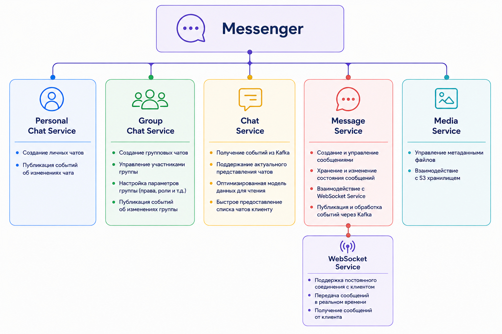
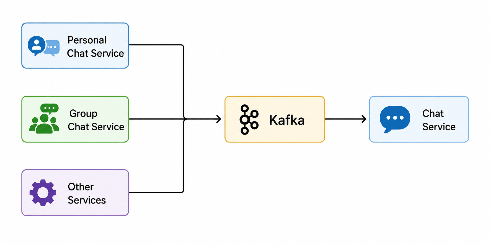

# Messenger

> Микросервисный мессенджер с событийной архитектурой, CQRS и постоянным WebSocket-соединением с клиентом.

**Messenger** — сервис обмена сообщениями в экосистеме Burkina.

Приложение построено как набор независимых микросервисов, каждый из которых отвечает за свою область ответственности. Для взаимодействия между сервисами используется **Apache Kafka**, для постоянного соединения с клиентами — **WebSocket**, а для ускорения работы с часто используемыми данными — **Redis**.

Каждый сервис имеет собственную базу данных, что позволяет независимо масштабировать и развивать отдельные компоненты системы.

Приложение оркестрируется с помощью **Kubernetes**.

---

## 📖 О проекте

Messenger предназначен для обмена сообщениями между пользователями экосистемы Burkina.

Основные возможности системы:

- личные чаты;
- групповые чаты;
- отправка и получение сообщений в реальном времени;
- работа через постоянное WebSocket-соединение;
- хранение медиафайлов;
- асинхронное взаимодействие между сервисами;
- быстрое получение информации о чатах;

Архитектура Messenger построена вокруг разделения операций **записи и чтения**, событийного взаимодействия и независимости сервисов.

---

# 🏗️ Архитектура

Общая архитектура Messenger представлена на диаграмме ниже:

---

# 🧩 Сервисы

---

## 👤 Personal Chat Service

**Personal Chat Service** отвечает за управление личными чатами между двумя пользователями.

Сервис является частью **модели записи (Write Model)** и отвечает за изменение состояния личных чатов.

Основные задачи:

- создание личного чата;
- управление участниками личного чата;
- изменение состояния чата;
- публикация событий об изменениях чата.

Personal Chat Service не предназначен для формирования оптимального представления чата для клиента.

---

## 👥 Group Chat Service

**Group Chat Service** отвечает за управление групповыми чатами.

Как и Personal Chat Service, он является частью **модели записи (Write Model)**.

Основные задачи:

- создание групповых чатов;
- управление участниками;
- изменение параметров группы;
- изменение состояния группового чата;
- обработка операций записи;
- публикация событий об изменениях.

Таким образом, Personal Chat Service и Group Chat Service отвечают за изменение состояния системы.

---

## 👁️ Chat Service

**Chat Service** является **моделью чтения (Read Model)** системы.

Он не является источником истины для управления состоянием чатов.

Вместо этого Chat Service получает события от других сервисов через **Apache Kafka** и на их основе поддерживает собственное представление данных о чатах.

Основная задача Chat Service — предоставить клиенту необходимую информацию о чатах в максимально удобном и быстром для чтения формате.

---

## 💬 Message Service

**Message Service** отвечает за управление сообщениями.

Он является центральным компонентом для операций, связанных с сообщениями.

Основные задачи:

- создание сообщений;
- получение сообщений;
- изменение состояния сообщений;
- обработка операций с сообщениями;
- взаимодействие с WebSocket Service;
- публикация событий;
- получение событий из Kafka.

Взаимодействие с клиентом происходит не напрямую, а через **WebSocket Service**.

---

## 🔌 WebSocket Service

**WebSocket Service** предоставляет постоянное двунаправленное соединение между клиентом и сервером.

В отличие от обычного HTTP-взаимодействия, WebSocket позволяет серверу отправлять данные клиенту без необходимости создания нового HTTP-запроса.

Это особенно важно для мессенджера, где сообщения должны доставляться в режиме реального времени.

---

## 🖼️ Media Service

**Media Service** отвечает за работу с медиафайлами, связанными с сообщениями и чатами.

Основные задачи сервиса:

- загрузка медиафайлов;
- получение медиафайлов;
- управление медиафайлами;
- взаимодействие с **S3-хранилищем**.

Сами медиафайлы хранятся в **S3-совместимом объектном хранилище**, а Media Service выступает посредником между клиентом и хранилищем.

Media Service отвечает за управление доступом к файлам и предоставляет необходимые данные для их загрузки и получения.

---

# 🧱 Архитектурные паттерны

В проекте используются следующие архитектурные и интеграционные паттерны:

| Паттерн                        | Назначение                                                                        |
|--------------------------------|-----------------------------------------------------------------------------------|
| **Microservices Architecture** | Разделение системы на независимые сервисы                                         |
| **Event-Driven Architecture**  | Взаимодействие сервисов через события                                             |
| **CQRS**                       | Разделение моделей чтения и записи для удобного и быстрого получения списка чатов |
| **Transactional Outbox**       | Гарантированная публикация событий в Kafka                                        |
| **Database per Service**       | Каждый сервис имеет свою базу данных для независимости и отказоустойчивости       |
| **WebSocket**                  | Постоянное двунаправленное соединение с клиентом                                  |
| **Caching**                    | Ускорение доступа к часто используемым данным через Redis                         |

---

# ☸️ Kubernetes

Приложение оркестрируется с помощью **Kubernetes**.

Каждый микросервис может быть развёрнут, масштабирован и обновлён независимо.

Kubernetes используется для:

- оркестрации контейнеров;
- масштабирования сервисов;
- управления жизненным циклом приложений;
- автоматического восстановления сервисов;
- service discovery;
- балансировки нагрузки;

---

# 🛠️ Технологический стек

| Технология        | Назначение                                    |
|-------------------|-----------------------------------------------|
| **Java 17**       | Основной язык разработки большинства сервисов |
| **Kotlin 2.1.0**  | Язык разработки Media Service                 |
| **Spring Boot 3** | Основной фреймворк                            |
| **REST API**      | Взаимодействие с клиентами                    |
| **WebSocket**     | Real-time взаимодействие                      |
| **PostgreSQL**    | Хранение данных                               |
| **Redis**         | Кэширование часто запрашиваемых данных        |
| **Apache Kafka**  | Взаимодействие между сервисами                |
| **Docker**        | Контейнеризация сервисов                      |
| **Kubernetes**    | Оркестрация и масштабирование приложения      |